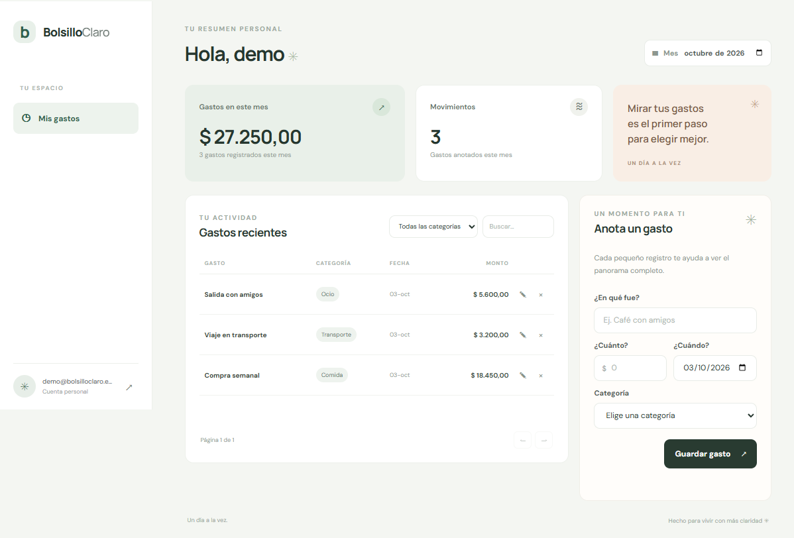

# Bolsillo Claro

Una app para que una persona registre sus gastos y entienda en qué se le va el dinero, en vez de llevarlo en notas o en la memoria.

## Demo

- App: [https://proyectofinal-frontend-ten.vercel.app/](https://proyectofinal-frontend-ten.vercel.app/)
- API: [https://proyectofinal-qz7q.onrender.com](https://proyectofinal-qz7q.onrender.com)
- Salud de la API: [https://proyectofinal-qz7q.onrender.com/api/health](https://proyectofinal-qz7q.onrender.com/api/health)
- Cuenta de prueba: `demo@bolsilloclaro.example` / `BolsilloDemo2026!`

La cuenta anterior es pública y se usa solo para mostrar la app; no guardes información personal en ella. También puedes crear tu propia cuenta.

## Capturas



## Qué incluye

- Registro e inicio de sesión con contraseñas hasheadas con bcrypt y JWT de 2 horas.
- Gastos privados por usuario: crear, listar, editar, eliminar, filtrar por mes/categoría y buscar.
- Resumen mensual y paginación.
- Ruta de administrador protegida por rol.
- Interfaz adaptable a celular; los datos ingresados se muestran como texto, nunca como HTML.

## Stack

Node.js, Express, PostgreSQL en Supabase, `pg`, bcryptjs, JWT, Helmet, CORS y HTML/CSS/JavaScript sin frameworks.

## Estructura

```text
src/
  config/       configuración y conexión a PostgreSQL
  controllers/  entrada HTTP y respuestas
  middlewares/  autenticación, roles y errores
  routes/       rutas de la API
  services/     lógica y consultas SQL parametrizadas
  utils/        validaciones y errores HTTP
frontend/       sitio estático para Vercel
schema.sql      tablas, índices y ejemplos de datos
requests.http   flujo de prueba y tres solicitudes que deben fallar
```

## Endpoints

| Método | Ruta | Protegida | Qué hace |
|---|---|---:|---|
| GET | `/api/health` | No | Comprueba que la API responde |
| POST | `/api/auth/register` | No | Crea una cuenta y devuelve un token |
| POST | `/api/auth/login` | No | Inicia sesión |
| GET | `/api/auth/me` | Sí | Devuelve el perfil sin datos sensibles |
| GET | `/api/transactions?month=AAAA-MM&page=1` | Sí | Lista y filtra los gastos propios |
| POST | `/api/transactions` | Sí | Crea un gasto |
| PUT | `/api/transactions/:id` | Sí | Actualiza un gasto propio |
| DELETE | `/api/transactions/:id` | Sí | Elimina un gasto propio |
| GET | `/api/admin/summary` | Sí, admin | Devuelve un resumen administrativo |

Las categorías válidas son `Comida`, `Transporte`, `Hogar`, `Salud`, `Ocio` y `Otros`. Los gastos están ligados a `user_id`; el servidor siempre obtiene ese ID del JWT y lo incluye en las consultas de lectura y modificación.

## Correrlo en local

Requiere Node.js 20 o superior y una base PostgreSQL de Supabase.

1. Clona el repositorio e instala las dependencias:

   ```bash
   git clone <URL-del-repositorio>
   cd <carpeta-del-repositorio>
   pnpm install
   ```

2. En Supabase, crea un proyecto y abre **SQL Editor**. Copia y ejecuta el contenido de `schema.sql`. El script crea las tablas, una cuenta pública de demostración y tres gastos de ejemplo; se puede volver a ejecutar sin duplicar esos datos.
3. Copia `.env.example` a `.env` y completa la conexión de PostgreSQL, el secreto JWT y el certificado TLS si Supabase lo requiere. En PowerShell:

   ```powershell
   Copy-Item .env.example .env
   node -e "console.log(require('node:crypto').randomBytes(48).toString('hex'))"
   ```

   Usa el resultado como `JWT_SECRET`. Para `DATABASE_URL`, copia la cadena de conexión PostgreSQL de Supabase. Si Node informa un error de certificado TLS, descarga el certificado raíz desde Database → Settings → SSL Configuration, guárdalo como `supabase-ca.crt` y deja `DATABASE_SSL_CA=./supabase-ca.crt`. Si la API corre fuera de Supabase, el pooler de sesión suele ser la opción más compatible.
4. En `frontend/config.js`, deja `http://localhost:3000/api` para desarrollo local.
5. En una terminal, arranca el backend:

   ```bash
   pnpm dev
   ```

6. Sirve la carpeta `frontend/` con una extensión de servidor estático, por ejemplo **Live Server** en VS Code (puerto 5500). `CORS_ORIGINS` ya permite `http://localhost:5500` y `http://127.0.0.1:5500`.
7. Registra una cuenta desde la interfaz y empieza a anotar gastos.

Prueba la API con `requests.http` usando REST Client. Para los endpoints privados, copia el `token` de la respuesta de login en la variable `@token`. Los tres casos al final del archivo deben responder `400`, `401` y `400`.

## Despliegue

Las instrucciones completas para GitHub, Supabase, Render y Vercel están al final de este README. Las claves se ingresan únicamente en los paneles de configuración; nunca se suben al repositorio.

### Variables del backend

| Variable | Ejemplo/uso |
|---|---|
| `NODE_ENV` | `production` en Render |
| `DATABASE_URL` | URL PostgreSQL de Supabase |
| `DATABASE_SSL_CA` | Opcional; ruta del certificado raíz oficial descargado desde Supabase |
| `JWT_SECRET` | Cadena aleatoria propia de al menos 32 caracteres |
| `CORS_ORIGINS` | URL local y URL exacta de Vercel, separadas por comas |
| `PORT` | Render la asigna automáticamente; local usa `3000` |

`frontend/config.js` contiene solo la URL pública de la API, no es un secreto. Al desplegar, se reemplaza por la URL de Render.

Si Node informa `self-signed certificate in certificate chain`, descarga el certificado raíz oficial desde **Supabase → Database → Settings → SSL Configuration**. Guarda el archivo en la raíz del proyecto como `supabase-ca.crt` y configura `DATABASE_SSL_CA=./supabase-ca.crt`. Esa ruta hace que el backend valide el certificado y el nombre del servidor. No uses `NODE_TLS_REJECT_UNAUTHORIZED=0` ni desactives la verificación TLS. El certificado raíz es público; nunca publiques `DATABASE_URL` ni `.env`.

## Seguridad aplicada

- bcrypt con factor 12 y JWT firmado con HS256 que expira en dos horas.
- SQL parametrizado con placeholders; el ID de usuario se toma del token y se usa en todas las consultas de gastos.
- Validación de cuerpo, parámetros, filtros, fechas, correo y montos.
- Helmet, CORS limitado a orígenes configurados y rate limit en registro/login.
- `.env` ignorado por Git; `.env.example` no contiene credenciales.
- Las respuestas de cuenta nunca incluyen el hash de la contraseña.

Para convertir una cuenta propia en admin, ejecuta en SQL Editor **solo después** de registrarla (cambia el correo):

```sql
UPDATE app_users SET role = 'admin' WHERE email = 'tu-correo@example.com';
```

Luego cierra sesión y vuelve a entrar para recibir un JWT con el rol actualizado. La ruta administrativa es `GET /api/admin/summary`.

## Guía paso a paso: GitHub, Supabase, Render y Vercel

Hazlo en este orden. Puedes pedirme que te acompañe de a un paso; no me envíes contraseñas, claves privadas ni el contenido de `.env`.

### 1. GitHub

1. Crea un repositorio **público** vacío en GitHub; no agregues un README desde la web.
2. En la terminal de VS Code, desde la carpeta del proyecto:

   ```bash
   git init
   git add .
   git status
   ```

3. Comprueba que `.env` no aparece en `git status`. Si aparece, detente y no lo subas.
4. Haz el primer commit y vincúlalo con la URL que GitHub te mostró:

   ```bash
   git commit -m "Crear Bolsillo Claro"
   git branch -M main
   git remote add origin <URL-del-repositorio>
   git push -u origin main
   ```

### 2. Supabase

1. Crea un proyecto y guarda su contraseña de base de datos en un gestor seguro.
2. Abre **SQL Editor → New query**, pega todo `schema.sql` y ejecútalo.
3. Abre **Connect** en el proyecto y copia una URI de PostgreSQL. Para Render, usa el **Session pooler** si la conexión directa no es accesible desde IPv4. Si la contraseña tiene caracteres especiales, utiliza la URI que genera Supabase o codifícala correctamente.
4. No compartas ni publiques `DATABASE_URL`; Render la recibirá como variable de entorno.

### 3. Render (API)

1. En Render elige **New → Web Service**, conecta GitHub y selecciona este repositorio.
2. Usa el runtime Node y estos comandos:
   - Build: `pnpm install --frozen-lockfile`
   - Start: `pnpm start`
3. Agrega `NODE_ENV=production`, `DATABASE_URL` (URI PostgreSQL de Supabase), `JWT_SECRET` (uno nuevo, aleatorio y de 48 bytes) y `CORS_ORIGINS` (temporalmente `http://localhost:5500`).
4. Cuando termine el deploy, abre `https://<tu-servicio>.onrender.com/api/health`. Debe responder `{"status":"ok"}`.
5. Guarda la URL de Render: la usarás en el frontend.

### 4. Vercel (frontend)

1. Antes de importar el proyecto en Vercel, edita `frontend/config.js` y reemplaza `http://localhost:3000/api` con `https://<tu-servicio>.onrender.com/api`. Haz commit y push de ese cambio (la URL de la API es pública, no una clave).
2. En Vercel importa el repositorio. En **Root Directory** selecciona `frontend`.
3. Para este frontend estático no hace falta comando de build; deja el output como `.` y despliega.
4. Copia la URL asignada por Vercel, sin barra final, y vuelve a Render. En `CORS_ORIGINS` deja, separados por coma:

   ```text
   http://localhost:5500,https://<tu-app>.vercel.app
   ```

5. Guarda los cambios en Render y espera que la API vuelva a desplegarse. Recarga la app de Vercel.
6. Registra dos cuentas distintas y comprueba que cada una solo ve sus propios gastos. Prueba crear, editar, borrar, cerrar sesión y volver a entrar.

### 5. Cuenta de prueba y entrega

Registra una cuenta desde la app y anota un gasto para la demo. No publiques una contraseña reutilizada: si necesitas compartir acceso para la evaluación, crea una cuenta de prueba con una contraseña temporal y cámbiala o elimínala después. Confirma que las dos URLs están activas, que el repositorio no contiene secretos y que `requests.http` muestra los tres casos fallidos.
# proyectofinal
